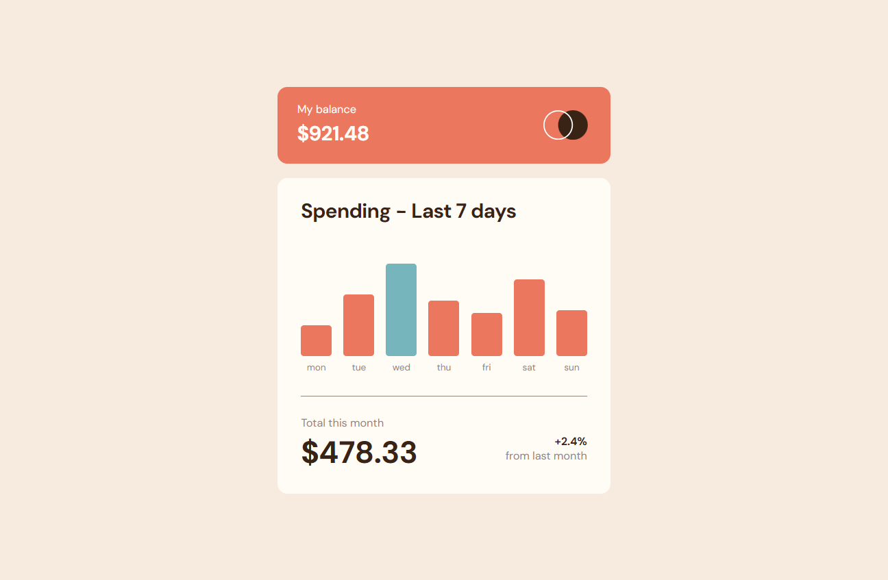
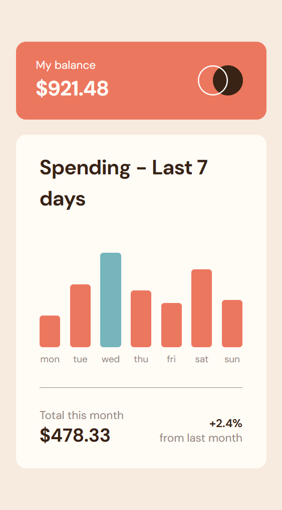

<h1 align="center" style="margin: 0">Expenses Chart Component</h1>

Solution to the Frontend Mentor challenge

This is a solution to the <a href="https://www.frontendmentor.io/challenges/expenses-chart-component-e7yJBUdjwt">Expenses chart component challenge on Frontend Mentor</a>. Frontend Mentor challenges help you improve your coding skills by building realistic projects.

## Screenshots

Desktop view (1440px wide)

Mobile view (450px wide)

## Links

- Live Site URL (I use Netlify for websites hosting) ⇒ https://expenses-chart-km9.netlify.app

## Overview

### Features

Users should be able to:

- View the bar chart and hover over the individual bars to see the correct amounts for each day
- See the current day’s bar highlighted in a different colour to the other bars
- View the optimal layout for the content depending on their device’s screen size
- See hover states for all interactive elements on the page

### Built with

- Angular
- HTML5
- Tailwind
- TypeScript

## Find me on other platforms

- Frontend Mentor ⇒ https://www.frontendmentor.io/profile/k-malkiewicz
- iCodeThis ⇒ https://icodethis.com/Kamil
- Codewars ⇒ https://www.codewars.com/users/k_malkiewicz
- freeCodeCamp ⇒ https://www.freecodecamp.org/kamil_malkiewicz